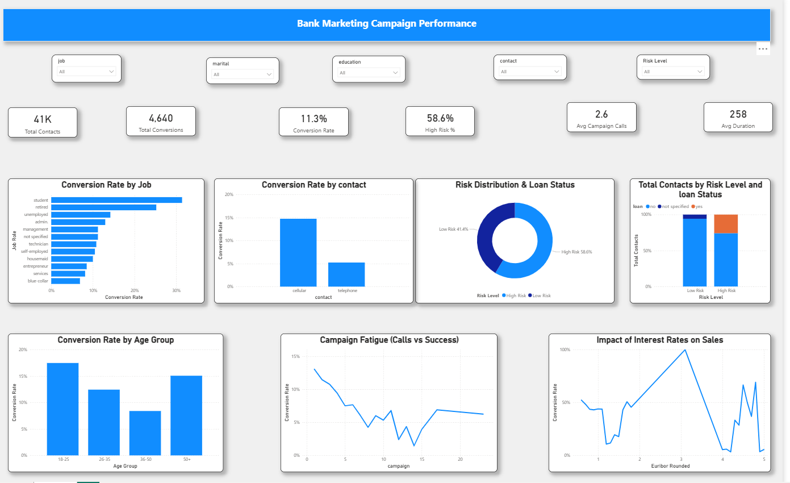

# Bank Marketing Campaign Performance Dashboard (Power BI)

## Overview
Interactive Power BI dashboard analyzing bank marketing campaign performance and conversion drivers across customer segments.

## Dashboard Preview

## KPIs
- Total Contacts
- Total Conversions
- Conversion Rate
- High Risk %
- Avg Campaign Calls
- Avg Call Duration

## Files
- PDF report: [Bank_Marketing_Dashboard.pdf](Bank_Marketing_Dashboard.pdf)

## Tools Used
Power BI, Power Query, DAX, Data Modeling, Data Visualization
